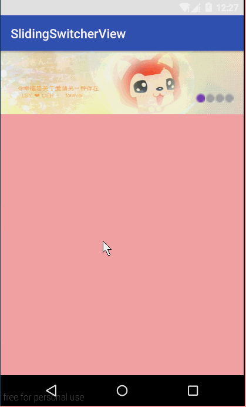

# slidingswitcherview
防淘宝客户端--图片切换器

# 效果图


# 用法
* 1.布局文件
```java
<cn.hzh.ssv.view.SlidingSwitcherView
        android:id="@+id/id_switch_view"
        android:layout_width="match_parent"
        android:layout_height="100dp">
        
        <LinearLayout
            android:layout_width="match_parent"
            android:layout_height="match_parent"
            android:orientation="horizontal">
            <ImageView
                android:layout_width="match_parent"
                android:layout_height="match_parent"
                android:background="@mipmap/image1"/>
            <ImageView
                android:layout_width="match_parent"
                android:layout_height="match_parent"
                android:background="@mipmap/image2"/>
            <ImageView
                android:layout_width="match_parent"
                android:layout_height="match_parent"
                android:background="@mipmap/image3"/>
            <ImageView
                android:layout_width="match_parent"
                android:layout_height="match_parent"
                android:background="@mipmap/image4"/>
        </LinearLayout>

        <LinearLayout
            android:layout_width="60dp"
            android:layout_height="20dp"
            android:layout_margin="16dp"
            android:orientation="horizontal"
            android:layout_alignParentBottom="true"
            android:layout_alignParentRight="true">
        </LinearLayout>
        
</cn.hzh.ssv.view.SlidingSwitcherView>
```
第一个LinearLayout为切换器的主布局，第二个LinearLayout放置右下角的标示；
由于SlidingSwitcherView继承自RelativeLayout，所以可以直接使用android:layout_alignParentBottom，android:layout_alignParentRight
等属性。省的我在代码中去layout子view。

* 2.事件处理
在activity编写如下代码，处理item的点击事件；
```java
mSsview = (SlidingSwitcherView) findViewById(R.id.id_switch_view);
mSsview.setOnItemClickListener(new SlidingSwitcherView.OnItemClickListener()
{
    @Override
    public void onClick(View view, int index)
    {
	Toast.makeText(MainActivity.this, index + "", Toast.LENGTH_SHORT).show();
    }
});
```
* 3.手动开关自动scroll功能
SlidingSwitcherView对外提供两个方法
```java
public void stopAutoScroll();
public void startAutoScroll();
```
# 代码分析
* 首先确定布局，在onLayout()方法中，确定第一个子view中的ImageView的大小，设置为父控件的宽度；然后初始化右下角标签布局
* 其次事件处理，在用户touch的时候通过动态改变第一个ImageView的leftMargin实现scroll功能。并在MotionEvent.UP的时候，通过异步任务实现自动scroll
* 最后，进行事件拦截；由于主要Touch的逻辑在onTouchEvent()方法中完成的，所以为了防止子view消耗掉事件，需要在onInterceptTouchEvent判断是否需要拦截；